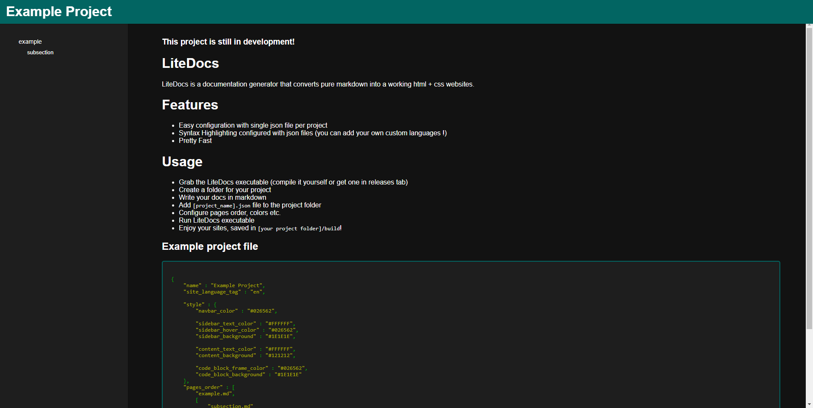

### This project is still in development!
# LiteDocs

LiteDocs is a documentation generator that converts pure markdown into a working html + css websites.  
See this README generated with LiteDocs:
<br><br>


# Features
- Easy configuration with single json file per project
- Syntax Highlighting configured with json files (you can add your own custom languages!)
- Pretty Fast

# Usage
- Grab the LiteDocs executable (compile it yourself or get one in releases tab)
- Create a folder for your project
- Write your docs in markdown
- Add ``[project_name].json`` file to the project folder
- Configure pages order, colors etc.
- Run LiteDocs executable
- Enjoy your sites, saved in ``[your project folder]/build``!

## Example project file
```json
{
    "name" : "Example Project",
    "site_language_tag" : "en",

    "style" : {
        "navbar_color" : "#026562",

        "sidebar_text_color" : "#FFFFFF",
        "sidebar_hover_color" : "#026562",
        "sidebar_background" : "#1E1E1E",

        "content_text_color" : "#FFFFFF",
        "content_background" : "#121212",

        "code_block_frame_color" : "#026562",
        "code_block_background" : "#1E1E1E"
    },
    "pages_order" : [
        "example.md",
        [
            "subsection.md"
        ]
    ]
}
```

## Note
- Sidebar does only work when website is hosted

## Adding syntax highlighting for custom languages
Adding syntax highlighting for a custom programming language is very easy in LiteDocs.
- Create 'langs' folder in the same directory as the LiteDocs.exe (if not exist already)
- Inside this folder create a json file named after the target language name abbreviation (for instance. 'py.json' for python, 'cpp.json' for c++ etc.)
- Add highlighting rules

Example rules for json code snipets:
```
{
    "breaks" : [
        " ", "\t", "\n", "\"", "{", "}", "[", "]", ","
    ],

    "rules" : [
        {
            "type" : "keywords",
            "keywords" : [":", "{", "}", "[", "]", ","],
            "color" : "#00AA00"
        },

        {
            "type" : "keywords",
            "keywords" : ["true", "false"],
            "color" : "#eb6734"
        },
    
        {
            "type" : "pairs",
            "begin" : "\"",
            "end" : "\"",
            "color" : "#AAAA00"
        },

        {
            "type" : "regex",
            "regex" : "[+-]?([0-9]*[.])?[0-9]+",
            "color" : "#eb6734"
        }
    ]
}
```
Explanation:
- ***Breaks*** is an array of *string delimiters* on which the syntax highlighter will *stop* when collectiing an ***token***  
- ***Rules*** is an array of ***rules objects***. Those can be one of the following types:  
      - ***Keywords rule*** is for highlighting certain words. Can be used, for example for keywords  
      - ***Pairs rule*** is for highlighting code between begin and end tokens (inclusive). Can be used for example for string literals  
      - ***Regex rule*** is for highlighting tokens that matches given regular expression. Can be used for example for coloring number literals  

Be combining those rules together, you can easily create syntax any language!

# Used Libs
Litedocs uses following libs:
- Nlohmann's json library [https://github.com/nlohmann/json](https://github.com/nlohmann/json) for reading json files
- My markdown to html parser [https://github.com/TakiKacper/MarkdownToHtmlParser](https://github.com/TakiKacper/MarkdownToHtmlParser) for parsing markdown files into html.


